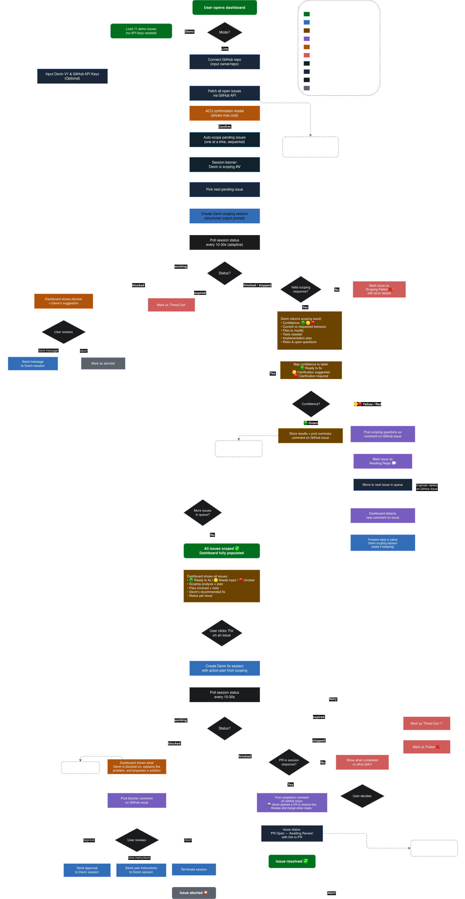
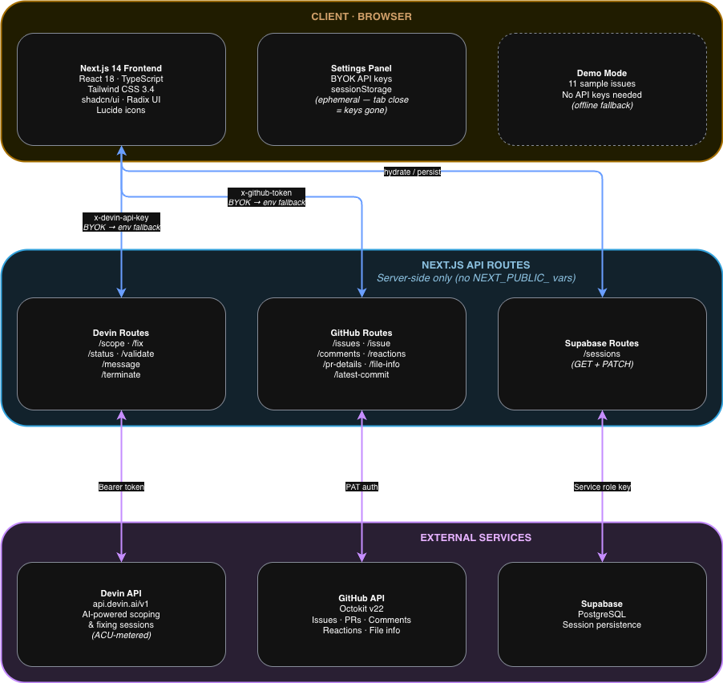

# Devin Issue Pilot

Devin already has confidence scoring and issue triage for Linear and Jira, but not for GitHub Issues. This dashboard fills that gap: connect a repo, auto-scope every open issue using Devin's native confidence (green/yellow/red), and trigger one-click fixes that open PRs.

**[Deployed App](https://devin-issue-pilot.vercel.app/)** · **[Video Walkthrough](#)** <!-- Replace # with Loom link -->

> The deployed app offers two modes: **Preview** (non-interactive demo with sample data, no keys needed) and **Live** (connect a real repo with your own API keys). To run it locally, see [Getting Started](#getting-started)).

---

## Features

**Core (task requirements):**
- See all open issues for a connected GitHub repo
- Trigger Devin to scope each issue with a structured confidence score (green/yellow/red)
- One-click fix: Devin takes the scoping plan and implements it, opening a PR

**Beyond the brief:**
- **Preview mode** is the default. 11 sample issues covering every UI state, no API keys needed.
- **BYOK API keys** let users bring their own Devin + GitHub keys via the Settings panel. Stored in `sessionStorage`, never persisted server-side.
- **Clarification flow**: when confidence is yellow/red, Devin's questions get posted as a GitHub comment. Replies auto-trigger re-scoping.
- **GitHub comment bridge** keeps Devin sessions and GitHub issue threads in sync, both directions.
- **Adaptive polling**: 10s for active fixes, 20s for scoping, 30s for blocked sessions.
- **Blocker handling**: when Devin gets stuck, the dashboard shows what happened, a suggested fix, and lets you approve, instruct, or abort.
- **ACU cost controls** with configurable per-session limits before any Devin session starts.
- **Supabase persistence** so session state survives page reloads (optional).

## How It Works

1. **Connect a repo** — enter `owner/repo` on the connect screen
2. **Issues load** — all open GitHub issues appear in the dashboard
3. **Scope an issue** — click "Scope" and Devin analyzes it, returning a confidence score (green/yellow/red) and action plan
4. **Review confidence** — green means Devin is confident it can fix it. Yellow/red means open questions remain
5. **Clarify if needed** — for yellow/red, Devin's questions are posted as a GitHub comment. Reply there and re-scope
6. **Fix** — once green, click "Fix" and Devin implements the plan and opens a PR



## Architecture



> **BYOK (Bring Your Own Keys):** Users can provide their own Devin and GitHub API keys via the Settings panel. Keys live in `sessionStorage` and get sent as request headers. If not provided, the server falls back to environment variables.

## Process

### 1. Research & Planning

Started with the requirements (connect to a repo, scope issues with Devin, fix them) and asked: what would make this feel natural for engineers who already live in GitHub?

Talked to former coworkers who use issue trackers daily. Three things kept coming up:

- **Don't waste compute on misunderstood issues.** They wanted to see what Devin thinks *before* anything runs. That became the scope-first flow: green means go, yellow/red means clarify first.
- **Keep everything in GitHub.** Nobody wanted to check another tab. Scoping results, questions, and fix confirmations should all live on the issue itself.
- **Make costs predictable.** Set a ceiling per session, don't discover the bill after.

I also looked at existing tools. [devin-cli](https://github.com/Saumya-Chauhan-MHC/devin-cli) proves the API pattern works, but it handles one issue at a time with no visual UI.

These insights shaped the [flowchart](./diagrams/devin-issue-pilot-flow_final.png): connect → scope → gate on confidence → clarify if needed → fix → PR.

### 2. Mockup & Build

Created a [UI mockup](./diagrams/devin-issue-pilot.pen) to lock down layout and interactions before writing code, then built the MVP: connect repo → list issues → scope → fix → PR.

### 3. User Testing & Iteration

Demoed the working app with coworkers and let them use it hands-on. Collected feedback and iterated, roughly 45 commits over the final push. The most impactful changes:

| What changed | Why |
|---|---|
| **GitHub comment bridge** | A tester said "I don't want to switch tabs to see what Devin found." So now scoping results, questions, and fix confirmations all get posted as GitHub issue comments. |
| **ACU cost transparency** | Initially estimated ACU usage from wall-clock time using Cognition's rate of 1 ACU ≈ 15 minutes (`minutes / 15`). This was wildly off because wall-clock includes idle/sleep time when Devin is waiting for replies. V1 of the Devin API doesn't report actual consumption, so I replaced the estimate with a configurable `max_acu_limit` ceiling (default: 3 for scoping, 15 for fixing) and a confirmation modal. |
| **Blocker transparency** | When Devin got stuck, the dashboard just said "blocked." Now it shows Devin's actual message, a suggested fix, and action buttons (approve / instruct / abort). |
| **Scope button silent no-op** | If one issue was already being scoped, clicking "Scope" on another did nothing. No error, no feedback. Fixed. |
| **API key locking** | Users could change API keys mid-session, breaking active Devin connections. Keys are now locked while any session is running. |
| **"Demo" → "Preview"** | Testers assumed "Demo mode" meant a toy version. Relabeled to "Preview" to clarify it's showing the full UI with sample data. |
| **Line numbers in diff viewer** | Requested directly: "I can't reference specific lines when reviewing." |
| **Race condition fixes** | Stale Supabase cache was serving old scoping data during re-analysis. Fire-and-forget writes created timing gaps. Fixed with terminal-state guards and awaited writes. |

## Design Decisions

| Decision | Why |
|----------|-----|
| **`useReducer` over Context/Redux** | Dashboard is the only consumer. Context would add indirection for zero benefit. 13 explicit action types keep mutations predictable. |
| **Adaptive polling** | Devin's API doesn't support webhooks or SSE, so polling is the only option. Intervals are status-dependent: 10s for fixes, 20s for scoping, 30s for blocked. |
| **`sessionStorage` for API keys** | Per-tab scope, wiped on close. Keys flow via custom headers (`x-devin-api-key`, `x-github-token`), never in URLs or server-side storage. |
| **Server-side API proxies** | All external calls go through Next.js API routes. No `NEXT_PUBLIC_` env vars. The client never touches Devin or GitHub APIs directly. |
| **Preview mode as default** | Zero setup for reviewers. Same components as live mode, just hardcoded data instead of API calls. |
| **Confidence-gated fixing** | Scoping and fixing are separate Devin sessions. Sessions don't share context, so the fix prompt must include the full issue body, scoping analysis, action plan, and file list. If anything is missing, Devin re-analyzes from scratch and wastes ACUs. Fixes only start after green confidence. Yellow/red triggers clarification first. |
| **Native confidence over custom scoring** | I initially designed a deterministic 0-100 system (root cause found = +30pts, tests exist = +15pts, etc.). Then I found that Devin 2.1 already has native confidence scoring that Cognition validated against real success rates. Building my own layer would mean ignoring better data. Focused effort on the dashboard UX and GitHub integration instead. |
| **GitHub API enrichment** | Devin only returns `files_to_modify` paths and `pull_request.url`. The dashboard calls GitHub's Contents API for file line counts and the Pull Request API for title, branch, and per-file diffs. No extra Devin ACUs. |
| **Idempotent sessions** | All session creation passes `idempotent: true`. If a user refreshes mid-scoping or a network retry fires, the API returns the existing session instead of creating a duplicate. Prevents double ACU charges. |
| **Devin API V1** | V1 covers everything this project needs: create sessions, poll status, send messages, read structured output. V2 is for enterprise admins (org-wide analytics, audit logs). V3 adds RBAC with service user credentials, which is overkill here and still in beta. V1 keeps auth to a single Bearer token. V2/V3 would add actual ACU consumption reporting, which is the natural next step. |

## Getting Started

The fastest way to try it is the **[deployed app](https://devin-issue-pilot.vercel.app/)** — fully functional, no setup needed. To run locally:

**Prerequisites:** Node.js 18+

### Quick Start

```bash
git clone https://github.com/natanwei/devin-issue-pilot.git
cd devin-issue-pilot
npm install
npm run dev
```

Open [http://localhost:3000](http://localhost:3000). Demo mode loads by default, no configuration needed.

### Live Mode

To connect a real GitHub repo and use Devin:

1. Click the settings gear on the connect screen
2. Enter your API keys:
   - **GitHub PAT** (`repo` scope) from [github.com/settings/tokens](https://github.com/settings/tokens)
   - **Devin API key** (prefix: `apk_user_`) from [app.devin.ai](https://app.devin.ai) settings
3. Click **Save & Validate**
4. Enter a repo (`owner/repo`) and connect

Your keys stay in your browser tab and are never stored on the server.

### Environment Variables

Copy `.env.example` to `.env.local` for server-side defaults:

| Variable | Required | Description |
|----------|----------|-------------|
| `GITHUB_TOKEN` | For live mode | GitHub PAT with `repo` scope. Fallback when no BYOK key is provided. |
| `DEVIN_API_KEY` | For live mode | Devin API key (prefix: `apk_user_`). Fallback when no BYOK key is provided. |
| `SUPABASE_URL` | Optional | Supabase project URL. Enables persistence across page reloads. |
| `SUPABASE_SERVICE_ROLE_KEY` | Optional | Supabase service role key. Required alongside `SUPABASE_URL`. |

All variables are server-side only, never exposed to the browser (no `NEXT_PUBLIC_` prefix).

Users can also supply keys directly via the Settings panel (BYOK). Per-request headers override server env defaults.

### Supabase (optional, highly recommended)

The app uses [Supabase](https://supabase.com) for persistence. Technically optional (every call is guarded with null checks and silent failure), but **highly recommended**:

- **Without Supabase:** scoping results, confidence scores, and fix progress reset on page refresh.
- **With Supabase:** everything persists across reloads. Confidence scores, scoping analysis, PR data, blocker history.

The persistence layer uses Supabase's client SDK directly. Any PostgreSQL-compatible database could replace it, but the app is wired for Supabase out of the box.

To set up persistence:

1. Create a [Supabase](https://supabase.com) project
2. Run the migrations in `supabase/migrations/` in order:
   - `001_create_issue_sessions.sql` — main `issue_sessions` table (status, confidence, scoping/fix JSONB, PR data, timestamps)
   - `002_add_comment_tracking.sql` — comment tracking columns
   - `003_add_fix_session_updated_at.sql` — fix session timestamp
3. Copy the project URL and service role key to your `.env.local`

### Deployment

Deployed on Vercel. API routes use `maxDuration: 60` for long-running Devin session operations.

```bash
npm run build
npm run start
```

## Testing

```bash
npm test              # 149+ tests (Vitest)
npm run test:watch    # Watch mode
npm run test:live     # Smoke test against live Devin API (burns ACUs)
```

## Tech Stack

| Layer | Technologies |
|-------|-------------|
| Frontend | Next.js 14, React 18, TypeScript, Tailwind CSS 3.4, shadcn/ui |
| Backend | Next.js API Routes (15 endpoints), server-side API keys |
| Database | Supabase (PostgreSQL) with JSONB columns (optional) |
| Testing | Vitest, 149+ tests |
| External | Devin API, GitHub API (Octokit), Google Fonts |

### Why This Stack

| Choice | Why |
|--------|-----|
| **Next.js 14** | Frontend + API routes in one deploy. Server-side routes keep secrets off the client. |
| **Tailwind + shadcn/ui** | Fast dark-mode UI without custom CSS. shadcn components are copy-pasted, not npm-installed, so they're fully customizable. |
| **Supabase** | Instant PostgreSQL with zero infra. JSONB columns store scoping/fix payloads without needing schema migrations for every field change. |
| **Vercel** | One-click deploy from GitHub. `maxDuration: 60` on API routes handles long Devin sessions. |
| **Vitest** | Fast, ESM-native test runner that shares the same TypeScript config as the app. |
| **sessionStorage for BYOK** | Per-tab scope, keys auto-wipe on tab close. No server-side storage, no cookie leaks. |

> See [`diagrams/`](./diagrams/) for the user-flow flowchart and UI mockup.
